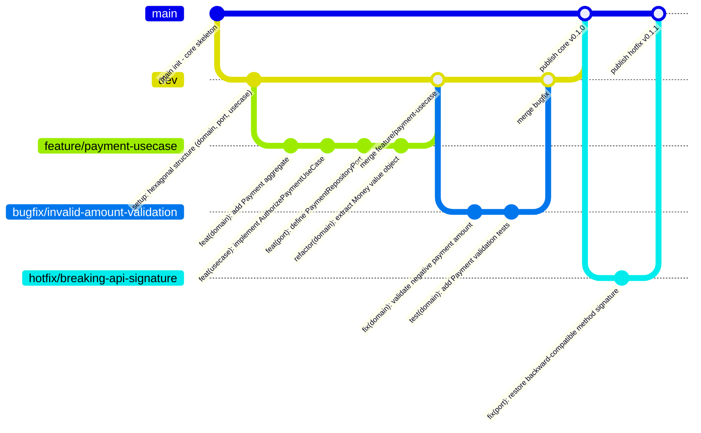

# 🔀 Merge Strategy

This repository enforces a **linear history** policy (`Merge Commit` and `Rebase & Merge` are **disabled**).

# 🛠 Branch Workflows

This repository follows a **simplified GitFlow-inspired** branching model (intentionally omits `release/*` branches to keep the workflow lightweight).

## 🏗 Branch Structure

`main` → Production-ready code. Only receives merges from `dev` and `hotfix/*`. Triggers artifact publishing.

`dev` → Integration branch for new features and bug fixes.

`feature/*` → For developing new features. Branch off from `dev`, merge back into `dev`.

`bugfix/*` → For fixing reported issues (non-critical, not blocking production). Must originate from a tracked issue/ticket. Branch off from `dev`, merge back into `dev`.

`hotfix/*` → For urgent/critical fixes in production. Branch off from `main`, merge back only into `main`.

## 🔄 Workflow Summary

### ✨ Feature Development

Create a `feature/*` branch from `dev`.
Used for new functionality.
Merge back into `dev`.

If a bug appears during feature development, it is resolved inside the same `feature/*` (not a separate `bugfix/*`).

Direct merge into main is **not allowed**.

### 🐞 Bug Fixing

Create a `bugfix/*` from `dev` to address a known issue (originating from an Issue Tracker).
Merge back into `dev` after review.

Direct merge into main is **not allowed**.

### 🔥 Hotfix for Production

For critical issues in production, create a `hotfix/*` from main.

After fixing:

Merge into `main` → triggers artifact publishing.

No merge back to `dev` is required automatically (synchronization handled separately if needed).

### 🚀 Promotion to Production

When `dev` is stable and validated:
Create a Pull Request from `dev` → `main`.

After approval and merge:
Artifact publishing pipeline is triggered.

### 📊 Visual

---

# 🛡 Branch Protection Rules

### 🔒 Protected

- **Applied** `main`
- **Restrict** `deletion` | `creation` | `updates`

### ⚙️ Workflows

- **Applied** `main` |`dev`
- **Restrict** `creations` | `deletions` | `force pushes`
- **Required**
    - `signed commit`
    - `pull request`
        - required approvals: 1
        - dismiss stale approvals when new commits are pushed
        - conversation resolution before merging
        - allowed merge: *Squash*
    - `status checks`
        - up to date before merging

### ✍️ Working

- **Applied** `feature/*` | `bugfix/*` | `hotfix/*`
- **Required** `signed commit`
